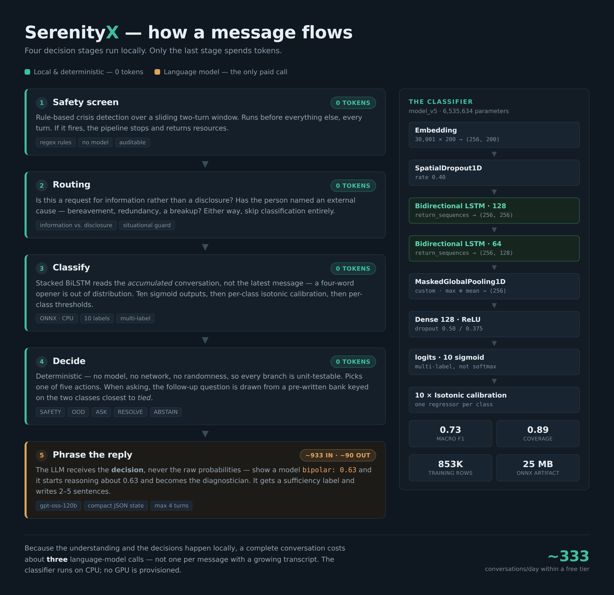
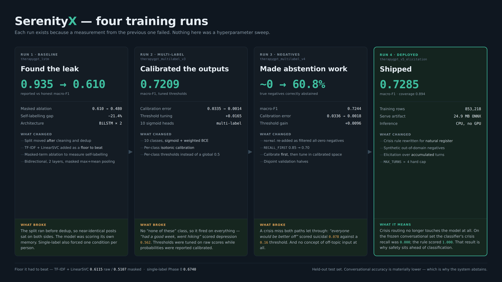

# SerenityX 🧠

### Hybrid AI Mental Health Support System

**A trained classifier handles understanding. Deterministic logic handles decisions. The language model only handles language.**

Most conversational AI products send every message to an LLM and let it decide everything. SerenityX doesn't. A local BiLSTM reads the conversation, a rule-based safety layer screens for crisis before anything else runs, a deterministic decision engine picks the action, and only then is a language model asked to phrase the result.

[](https://serenity-ai-system.vercel.app/)


**Live demo:** https://serenity-ai-system.vercel.app/
**This repository:** https://github.com/malekmahmoudd/Serenity-Ai-System

> **SerenityX is an engineering project, not a medical device.** It is not a therapist, not a doctor, and not a crisis service. Anything it surfaces is a starting point for a conversation with a qualified person, never a diagnosis. See [Limitations & safety notice](#limitations--safety-notice).

---

## ⚠️ The system spans two repositories

This repository contains the **frontend** (Next.js monorepo). The Python backend — classifier, calibration, safety rules, decision engine and LLM integration — lives in a **separate repository**, referenced here as a git submodule at `Serenity/backend`.

| Component | Repository |
|---|---|
| Frontend, UI, auth proxy routes | **this repo** — `Serenity/apps/web` |
| Classifier, safety, decision engine, LLM layer, tests, Dockerfile | [`malekmahmoudd/Serenity-Backend`](https://github.com/malekmahmoudd/Serenity-Backend) |

To get both:

```bash
git clone --recursive https://github.com/malekmahmoudd/Serenity-Ai-System.git
```

Throughout this README, backend files are cited by their path inside the backend repository (`safety.py`, `decision.py`, …). Every figure quoted is attributed to the file it came from.

---

## Table of contents

- [Project overview](#project-overview)
- [Core architecture](#core-architecture)
- [Architecture diagram](#architecture-diagram)
- [Production stack](#production-stack)
- [Machine learning](#machine-learning)
- [Probability calibration](#probability-calibration)
- [Safety architecture](#safety-architecture)
- [Decision engine](#decision-engine)
- [LLM integration](#llm-integration)
- [Cost](#cost)
- [Repository structure](#repository-structure)
- [Local development](#local-development)
- [Environment variables](#environment-variables)
- [API](#api)
- [Model training](#model-training)
- [Testing](#testing)
- [Deployment](#deployment)
- [Design decisions](#design-decisions)
- [Limitations & safety notice](#limitations--safety-notice)
- [License](#license)
- [Author](#author)

---

## Project overview

People who are struggling rarely begin by booking an appointment. They begin by trying to put words to it. SerenityX is built for that first step: anonymous conversation, no signup, no intake form.

The engineering problem is that the obvious architecture fails on three counts:

1. **A generative model shouldn't decide what someone's condition is.** That decision needs to be inspectable.
2. **Crisis handling must be deterministic and auditable.** You cannot ship a safety path whose behaviour you can only sample.
3. **Per-message LLM calls are expensive**, and expense means a paywall — which for this product is a failure, not a business model.

So responsibilities are split:

| Layer | Responsibility | Implementation |
|---|---|---|
| Safety | Detect crisis language | Rule-based, runs first, every turn |
| Understanding | What is this conversation about? | BiLSTM over accumulated turns |
| Confidence | Are the scores trustworthy? | Per-class isotonic calibration |
| Decision | What should happen next? | Deterministic — no model, no network, no randomness |
| Language | Phrase the decision | LLM, and only here |

Stages 1–4 run locally and cost zero LLM tokens. Only the final stage makes a paid call, and it receives a decision that has already been made.

---

## Core architecture

```text
User message
     │
     ▼
1 · SAFETY            rule-based crisis screening, sliding two-turn window
     │                runs before everything else, on every turn
     ▼
2 · ROUTING           information request? named external cause?
     │                decides whether classification is needed at all
     ▼
3 · CLASSIFICATION    BiLSTM via ONNX Runtime, CPU
     │                classifies the ACCUMULATED conversation, not the latest message
     ▼
4 · CALIBRATION       10 × isotonic regression, one per class
     │                per-class thresholds in calibrated space
     ▼
5 · DECISION          deterministic; every branch unit-testable
     │
     ├──▶ SAFETY · OOD · ASK · RESOLVE · ABSTAIN
     │
     ▼
6 · GENERATION        LLM receives the decision, never raw probabilities
     │
     ▼
   Response
```

### What causes each decision state

| State | Trigger | Response |
|---|---|---|
| `SAFETY` | Crisis rule matched on this turn, or across the two-turn window | Crisis resources; classification is skipped entirely |
| `OOD` | Enough text to judge, but every class below the out-of-domain floor | States it is here for emotional support; does not read distress into an off-topic query |
| `ASK` | Not enough evidence yet, or two classes too close to separate | One targeted follow-up question |
| `RESOLVE` | A label cleared its calibrated threshold, with enough tokens and a sufficient margin | Names the pattern, hedged, and defers to a qualified person |
| `ABSTAIN` | Turn cap reached, or plenty of text and still genuinely ambiguous | General support, no category named |

Source: `decision.py` in the backend repository.

---

## Architecture diagram



*The five local stages and the single paid call. Generated from the implementation; see the source-attribution notes in each section below.*

---

## Production stack

**Frontend** (this repository)

| Technology | Version | Verified in |
|---|---|---|
| Next.js | 14.2.35 | `Serenity/apps/web/package.json` |
| React | 18.2 | same |
| TypeScript | 5.9 (root) / 5.4+ (app) | `Serenity/package.json` |
| Tailwind CSS | v4.1 via `@tailwindcss/postcss` | `Serenity/apps/web/package.json` |
| Radix UI | 1.4 (unified `radix-ui` package) | same |
| Framer Motion | 11/12 | same |
| Turborepo | 2.8+ | `Serenity/package.json` |
| Node | ≥ 20, npm 11 | `engines` / `packageManager` |

**Backend** ([separate repository](https://github.com/malekmahmoudd/Serenity-Backend))

FastAPI · Uvicorn (single worker) · ONNX Runtime · scikit-learn · PostgreSQL · Groq · Docker `python:3.12-slim`

### Request flow

There are two distinct paths from browser to backend, and the split is deliberate:

1. **Auth** — browser → Next.js API route → server-side proxy via `BACKEND_URL` → FastAPI `/auth/*`. Credentials never cross an origin boundary from the browser's perspective.
2. **Chat** — browser → FastAPI `/chat` directly, via `NEXT_PUBLIC_API_BASE`. This avoids a serverless hop on the latency-sensitive path, at the cost of being a genuine cross-origin request, which is why the backend keeps an explicit CORS allowlist.

The proxy client is `Serenity/apps/web/lib/server/backend.ts`; its origin resolution is `BACKEND_URL` → `NEXT_PUBLIC_API_BASE` → `http://127.0.0.1:8000`.

---

## Machine learning

All figures below come from the backend repository's `artifacts/run_report.json` and from loading `artifacts/model_v5.keras` directly.

**Architecture** — a bidirectional LSTM with ten independent sigmoid outputs. Multi-label rather than multi-class, because these conditions genuinely co-occur.

```text
Embedding            30,001 × 200
SpatialDropout1D     rate 0.40
Bidirectional LSTM   128 units, return_sequences
Bidirectional LSTM    64 units, return_sequences
MaskedGlobalPooling1D  custom — masked max ⊕ mean over time
Dropout              0.50
Dense                128, ReLU
Dropout              0.375
logits               10, sigmoid (multi-label)
─────────────────────────────────────────────
Total parameters     6,535,634
```

| Property | Value |
|---|---|
| Vocabulary | 30,000 tokens + `<OOV>` |
| Sequence length | 256, post-padded and post-truncated |
| Output | Sigmoid logits, **10 deployed labels** |
| Training classes | **11** — the 10 labels plus an explicit `normal` negative class |
| Labels | adhd · anxiety · autism · bipolar · bpd · depression · ocd · ptsd · schizophrenia · suicidal |
| Loss | Weighted binary cross-entropy |
| Training rows | 1,055,629 raw → **853,218** after cleaning |
| Negatives | 32,796 · genuinely multi-label rows: 1,659 |
| **Macro-F1 (held out)** | **0.7285** |
| **Coverage** | **0.894** |
| Serve artifact | **24.9 MB** ONNX, exported from a 74.9 MB Keras model |
| Inference | CPU only — no GPU provisioned |

### The custom pooling layer

`MaskedGlobalPooling1D` concatenates masked max-over-time and masked mean-over-time. It exists because stock `GlobalMaxPooling1D` does not reliably honour a propagated mask, and Keras RNNs default to `zero_output_for_mask=False` — so padded timesteps hold a *repeat of the last valid output* rather than zeros. Pooling over them is silently wrong: no exception, just a worse model. This computes the mask from the token ids directly instead of trusting propagation.

### Two serving paths

| | Keras | ONNX (preferred) |
|---|---|---|
| Artifact | 74.9 MB | **24.9 MB** |
| Runtime | ~600 MB (TensorFlow) | ~15 MB (onnxruntime) |
| Import cost | Graph tracing at startup | None |

The export script refuses to promote the ONNX artifact unless its output matches the Keras model within tight tolerance on real sentences. The Keras path stays available via `USE_ONNX=false` for A/B verification. The production image ships the ONNX path only — TensorFlow is an export-time dependency and never reaches the server.

**Five artifacts ship together** — model, tokenizer (JSON, not pickle, because pickles break across TF versions and fail at service start-up), calibrators, thresholds, and an explicit label map. A model without its exact tokenizer and calibrators is not loadable, and mismatched versions fail silently rather than loudly.

---

## Probability calibration

A raw sigmoid output of `0.63` is not a 63% probability. Neural networks are routinely over- or under-confident, and the amount varies per class — which matters enormously here, because a **deterministic decision engine downstream compares those numbers against fixed thresholds**. Uncalibrated scores make those thresholds meaningless.

So each of the ten classes gets its own **isotonic regression** calibrator, and each gets its own cut point **in calibrated space**:

| | Value |
|---|---|
| Calibrators | 10 × `sklearn.isotonic.IsotonicRegression`, one per class |
| Per-class thresholds | 0.28 – 0.47 |
| Expected calibration error | 0.0336 → **0.0018** |

There is no global `0.5` cutoff anywhere in the system.

One result worth recording: once isotonic calibration was applied, the additional gain from threshold tuning collapsed from `+0.0165` to `+0.0096` — because after calibration, 0.5 is already close to optimal. The two techniques overlap far more than expected.

---

## Safety architecture

Crisis detection is **deliberately not the model's job**. This is the single most important design decision in the project, and it was forced by a measurement.

> On the frozen conversational evaluation set, the classifier's crisis recall was **0.000** — it never once fired `suicidal` on a conversational example. The hand-written rule scored **1.000** on the same set.
>
> — `safety.py`, backend repository

The reason is in the data: the training corpus is people writing long-form posts who already use clinical vocabulary. Real users in distress write *"everyone would be better off."*

Consequently:

- Crisis screening is **rule-based** and runs **before any classification**, on **every turn**
- It uses a **sliding two-turn window**, so an expression split across a message boundary is caught, without a single disclosure pinning the session in crisis mode forever
- The classifier's `suicidal` score may only **escalate**, never **gate**
- The patterns are deliberately over-broad. A false positive costs one unnecessary message with support resources attached; a false negative costs someone in crisis receiving generic advice about managing their anxiety. Those costs are not symmetric, so this is not tuned for balance.

This is not presented as a model failure. It is a measured result about which mechanism is appropriate for which job — and a rule generalises to phrasing the training data never contained, while a classifier does not.

**Honest caveat:** a hand-written pattern list is brittle to phrasing nobody anticipated. `crisis_patterns.json` should be treated as a living artifact reviewed against real logs, not a solved problem.

---

## Decision engine

The decision layer is **entirely deterministic — no model, no network, no randomness**. That is the point: every branch can be exhaustively unit-tested, which matters when one of those branches is crisis handling.

Thresholds and caps, as defined in `decision.py`:

| Constant | Value | Meaning |
|---|---|---|
| `MAX_TURNS` | 4 | Hard cap on follow-up questions |
| `MIN_TOKENS_TO_RESOLVE` | 15 | Minimum accumulated evidence before naming a category |
| `AMBIGUOUS_TOKENS` | 100 | Above this, stop asking and route to general support |
| `OOD_FLOOR` | 0.08 | Every class below this ⇒ no signal at all |
| `OOD_MIN_TOKENS` | 8 | Never judge out-of-domain on an opener |
| `SIGNAL_FLOOR` | 0.15 | Below this, don't hand the LLM a discriminating question |
| `MARGIN` | 0.08 | Near-tie ⇒ treat as unresolved |
| `SITUATIONAL_GRACE_TURNS` | 3 | Turns for which a named external cause blocks a clinical label |

Three behaviours worth calling out:

**Classification runs on accumulated turns, not single messages.** *"I can't sleep"* is nearly meaningless. The model was trained on ~114-token posts, so a four-word opener is out of distribution — concatenating turns moves the input back toward what the model actually knows, so confidence rises for the right reason.

**Follow-up questions are keyed on the two classes closest to *tied***, not the top two, because a near-tie is the axis a question can actually resolve. Selecting on raw top-2 made anxiety/depression fire in 5 of 6 test conversations, because those two dominate by prior in early turns.

**Named external causes suppress clinical labels.** Grief, redundancy and divorce look like depression to a model trained on forum posts. When a user names a real event, the reply addresses the event and no category is named for several turns. Grief is not a symptom.

**Two kinds of abstention with opposite correct responses:** below the token floor, low confidence means *not enough text* → ask for more. Above it, low confidence means *genuinely ambiguous or out of domain* → stop asking and route to general support.

---

## LLM integration

**The ML layer produces structured state. The decision engine chooses the action. The LLM writes prose.**

| | |
|---|---|
| Provider | Groq |
| Model | `openai/gpt-oss-120b` |
| Integration | `llm.py`, direct HTTPS call |
| `max_tokens` | 400 |
| `reasoning_effort` | `low` |

**What the model receives:** a compact JSON state object — leading categories, evidence sufficiency, safety flags, situational causes, turn count, and the chosen action — plus a capped slice of conversation history.

**What it never receives: raw probabilities.** If the model sees `bipolar: 0.63` it starts reasoning about `0.63` and quietly becomes the diagnostician. It gets a sufficiency *label* instead. This is a safety decision that also happens to shrink the prompt.

**Why not use the LLM to classify?** Three reasons, all measured or structural: crisis detection needs to be auditable rather than sampled; a per-message LLM call scales cost with conversation length; and the decision needs to be reproducible for the same input, which a temperature-sampled model is not.

**Failure handling.** The layer degrades rather than failing. No API key ⇒ hand-written templates, hedged the same way the system prompt requires. A truncated or empty completion (`finish_reason == "length"`) raises and falls back to the template — a half-finished sentence is worse than a template, particularly on the turn where someone has just said yes to help. The crisis path never depends on a third-party API being reachable.

---

## Cost

Measured against the Groq API on an identical three-turn conversation, using token counts reported by the API rather than estimates. Method: `estimate_capacity.py` and a scripted A/B in the backend repository.

At list pricing for `gpt-oss-120b` (**$0.15/M input, $0.75/M output**):

| Architecture | Input tokens | Output tokens | Cost / conversation | Cost / 10k |
|---|---:|---:|---:|---:|
| Hybrid (as first measured) | 3,072 | 858 | $0.001104 | $11.04 |
| LLM-only equivalent | 2,142 | 711 | $0.000855 | $8.55 |

**The honest finding: on a short conversation, the hybrid was initially the more expensive of the two.** It sends a system prompt, a structured state object *and* conversation history, where the LLM-only path sends a prompt and a transcript.

Two things are worth knowing about that result:

1. **The LLM-only path failed the task.** On turn two it false-fired crisis detection on a description of depression symptoms and returned nothing but two phone numbers — then did it again on turn three. The hybrid resolved correctly. The comparison is equal on tokens and not equal on behaviour.
2. **Output dominates the bill.** Output bills at 5× input, so 858 output tokens cost more than 3,072 input tokens. Setting `reasoning_effort: low` — this layer only phrases a decision made upstream, so it has nothing to reason about — cut measured output from **286 to 122 tokens per turn**, bringing the normalised three-turn cost to roughly **$7.89 per 10k**.

Remaining headroom, not yet applied: Groq caches identical prompt prefixes automatically at a 50% discount, and the structured state is currently serialised with `indent=2` including a human-readable `reason` field the model never uses.

> Pricing changes. Treat these as a point-in-time measurement of one conversation shape, not a universal cost model.

---

## Repository structure

```text
Serenity-Ai-System/
├── README.md
├── .gitignore
├── .gitmodules                       # points Serenity/backend at the backend repo
├── docs/
│   ├── architecture-pipeline.png
│   └── model-evolution.png
└── Serenity/                         # npm-workspaces monorepo (Turborepo)
    ├── package.json                  # workspaces, shared scripts, React overrides
    ├── turbo.json                    # task graph + globalEnv
    ├── backend  ──▶ submodule        # Serenity-Backend (classifier, safety, decision, LLM)
    ├── apps/
    │   └── web/                      # Next.js 14 App Router frontend
    │       ├── app/
    │       │   ├── api/auth/         # login · logout · me · register (server-side proxy)
    │       │   ├── therapy/new/      # the conversation UI
    │       │   ├── dashboard/        # signed-in wellness view
    │       │   ├── games/            # breathing + ocean-wave exercises
    │       │   └── …                 # login · signup · about · features · privacy
    │       ├── components/           # header, footer, consent modal, games, mood tracker
    │       ├── lib/
    │       │   ├── contexts/         # session context
    │       │   ├── server/           # backend client
    │       │   └── wellness-store.ts # localStorage persistence
    │       └── vercel.json           # framework + monorepo install command
    └── packages/
        ├── ui/                       # shared components (@workspace/ui)
        ├── eslint-config/
        └── typescript-config/
```

| Path | Purpose |
|---|---|
| `Serenity/apps/web` | The deployed Next.js application — 9 page routes, 4 API routes |
| `Serenity/packages/ui` | Shared component library consumed via `@workspace/ui` |
| `Serenity/backend` | Submodule. All ML, safety, decision and LLM code |
| `docs/` | Architecture diagrams referenced from this README |

---

## Local development

Requires **Node ≥ 20** and **npm 11**. The backend additionally requires **Python 3.12**.

### 1. Clone with the backend submodule

```bash
git clone --recursive https://github.com/malekmahmoudd/Serenity-Ai-System.git
cd Serenity-Ai-System
```

Already cloned without `--recursive`?

```bash
git submodule update --init --recursive
```

### 2. Frontend

```bash
cd Serenity
npm install                # installs all workspaces from the monorepo root

cp apps/web/.env.example apps/web/.env
# edit apps/web/.env and point NEXT_PUBLIC_API_BASE at your backend

npm run dev                # turbo dev
```

Other workspace scripts, all defined in `Serenity/package.json`:

```bash
npm run build              # turbo build
npm run typecheck          # tsc --noEmit across workspaces
npm run lint               # eslint
npm run format             # prettier
```

### 3. Backend

Setup lives in the [backend repository](https://github.com/malekmahmoudd/Serenity-Backend); in outline:

```bash
cd Serenity/backend
python -m venv venv && source venv/bin/activate   # Windows: venv\Scripts\activate
pip install -r requirements.txt

cp .env.example .env       # if present; otherwise see that repo's documentation
python main.py
```

**Model artifacts are not in git.** They total roughly 100 MB of binary files and are gitignored deliberately. Without them the service still boots — `classifier.available()` returns `False` and the decision layer runs rule-only, which is intentional so you can exercise the whole request path before the model files are in place.

---

## Environment variables

**Frontend** — see `Serenity/apps/web/.env.example`. Both are declared in `Serenity/turbo.json` under `globalEnv` so Turborepo cache keys invalidate correctly.

| Variable | Scope | Purpose | Required |
|---|---|---|---|
| `NEXT_PUBLIC_API_BASE` | Client | Backend origin for `POST /chat`. Inlined at build time — changing it needs a **redeploy**, not a restart | Yes |
| `BACKEND_URL` | Server | Backend origin for the `/api/auth/*` proxy routes | Falls back to `NEXT_PUBLIC_API_BASE` |
| `NEXT_PUBLIC_DEBUG_SESSION` | Client | Verbose session logging | No |
| `NEXT_PUBLIC_DEBUG_NAV` | Client | Verbose navigation logging | No |
| `API_DEBUG` | Server | Verbose API request logging | No |

**Backend** — canonical list is in that repository's `config.py`, which validates at import and **refuses to boot in production if anything is missing**, rather than serving in a degraded state.

| Variable | Purpose | Required in production |
|---|---|---|
| `SERENITY_ENV` | `production` enables strict config validation | Yes |
| `DATABASE_URL` | PostgreSQL connection string | Yes |
| `SERENITY_ENC_KEY` | Encryption key for stored conversations | Yes |
| `SERENITY_JWT_SECRET` | JWT signing secret | Yes |
| `GROQ_API_KEY` | LLM provider key | Yes |
| `ALLOWED_ORIGINS` | CORS allowlist, comma-separated, exact match. A wildcard in production is a **boot failure**, not a warning | Yes |
| `USE_ONNX` | `false` forces the Keras path | No |
| `SERENITY_ADMIN_TOKEN` | Gates `/metrics` and `/dashboard` | No |
| `RETENTION_DAYS` | Conversation retention, default 90 | No |
| `STORE_TEXT` | Whether message text is persisted | No |

No secrets are committed to this repository.

---

## API

### Frontend routes (this repository)

Thin proxies to the backend, so browser credentials stay same-origin. Implemented in `Serenity/apps/web/app/api/auth/`.

| Method | Route | Purpose |
|---|---|---|
| `POST` | `/api/auth/register` | Create an account |
| `POST` | `/api/auth/login` | Exchange credentials for a JWT |
| `POST` | `/api/auth/logout` | Invalidate the client session |
| `GET` | `/api/auth/me` | Current user from a bearer token |

### Backend endpoints

| Method | Route | Purpose |
|---|---|---|
| `POST` | `/chat` | The pipeline. Body: `{ "message": string, "session_id": string \| null }` |
| `POST` | `/auth/register` | Account creation — scrypt hash + signed JWT |
| `POST` | `/auth/login` | Login. Returns an **identical error** for unknown account and wrong password, so it cannot enumerate registered addresses |
| `GET` | `/auth/me` | Current user |
| `GET` | `/health` | Classifier readiness, labels, thresholds, storage config, rate limits, metrics |
| `GET` | `/metrics` | Admin only |
| `GET` | `/dashboard` | Admin only — HTML status page with per-class thresholds and a live turn log |
| `POST` | `/reset` | Clear a session |

**`POST /chat` response fields**

| Field | Meaning |
|---|---|
| `gpt_response` | The reply text |
| `session_id` | Session identifier to send with the next turn |
| `action` | `SAFETY` · `OOD` · `ASK` · `RESOLVE` · `ABSTAIN` |
| `labels` | Categories that cleared threshold — empty unless `RESOLVE` |
| `crisis` | Whether the safety rule fired |
| `turn` | Turn number in this session |
| `evidence_tokens` | Accumulated token count the decision was made on |

Rate limiting is a token bucket, not a fixed window: 20/min authenticated, 10/min anonymous, 5/min on auth endpoints. Each `/chat` call runs an LSTM forward pass *and* an LLM request, which makes it one of the more expensive endpoints to leave unguarded.

---

## Model training

Training was done in Kaggle notebooks; the trained artifacts are copied into the backend's `artifacts/` directory. **Four successive models were trained, each one addressing a measurement from the previous run.**



| Run | Notebook | Outcome |
|---|---|---|
| 1 | `therapygpt_lstm` | Found a **data leak**: the split ran before deduplication, so near-identical posts sat on both sides. A reported 0.935 was measuring memorisation. Also measured self-labelling — with diagnostic terms masked, macro-F1 fell 0.610 → 0.480, a 21.4% relative gap |
| 2 | `therapygpt_multilabel_v3` | Multi-label, 10 sigmoid heads, weighted BCE. Macro-F1 **0.7209**. Isotonic calibration took ECE 0.0335 → 0.0014 |
| 3 | `therapygpt_multilabel_v4` | Re-added `normal` as filtered all-zero negatives; calibrate **first**, then tune thresholds in calibrated space. Macro-F1 **0.7244**; abstention went from roughly zero to **60.8%** of true negatives |
| 4 | `therapygpt_v5_elicitation` | **Production model.** Crisis rule rewritten for natural register, synthetic out-of-domain negatives, elicitation loop over accumulated turns. Macro-F1 **0.7285**, coverage **0.894** |

**Only run 4 is deployed.** Runs 1–3 are development history and are not the production classifier.

The four training notebooks above are not currently published on Kaggle. One earlier, unrelated experiment is public:

- Initial 50K-sample LSTM (early experiment, **not** the production model) — [`sentiment-analysis-lstm`](https://www.kaggle.com/code/malekmahmoudd/sentiment-analysis-lstm)

### Baselines the model had to beat

Published deliberately, because a model that isn't compared to a cheap baseline hasn't been shown to earn its inference cost:

| Reference | Macro-F1 |
|---|---|
| TF-IDF + LinearSVC | 0.6115 raw / 0.5107 with diagnostic terms masked |
| Phase 0, single-label, 11 classes | 0.6740 |
| **Production, multi-label** | **0.7285** |

---

## Testing

The backend carries the test suite. It runs through a single entry point rather than pytest, and each file is self-contained with its own stubs so it can also be run standalone.

```bash
cd Serenity/backend
python run_tests.py
```

| Test file | Covers |
|---|---|
| `test_decision.py` | The deterministic decision layer — the safety-critical core |
| `test_signal_floor.py` | The "greeting answered with a clinical question" bug and its fix |
| `test_informational.py` | Information requests answered without an elicitation follow-up |
| `test_reply_integrity.py` | No repeated follow-up questions; truncated or empty completions replaced by templates |
| `test_ratelimit.py` | Token-bucket behaviour |
| `test_auth.py` | scrypt hashing, JWT issuing and verification |
| `test_persistence.py` | Encrypted storage and retention |
| `test_onnx_path.py` | ONNX/Keras output parity — **skipped** unless model artifacts are present |

The decision layer is deterministic by design, which is what makes exhaustive branch testing possible at all.

**Automated checks:** a GitHub Actions workflow exists at `Serenity/.github/workflows/backend-tests.yml`. See [Known issues](#known-issues) — in its current location it does not run.

### Known issues

Verified during this audit and documented rather than silently changed:

- **The CI workflow does not execute.** GitHub Actions only reads workflows from `.github/workflows/` at the *repository root*. This one sits at `Serenity/.github/workflows/`, so it is never picked up. Its path filters (`backend/**`) and `working-directory: backend` also assume a layout where the backend is at the repo root.
- **The `Serenity/backend` submodule pointer is stale.** It references an older backend commit than that repository's current `main`. Update with `git submodule update --remote Serenity/backend`.
- **Stray root-level files.** `package.json`, `package-lock.json` and `tailwind.config.js` sit at the repository root, separate from the real monorepo under `Serenity/`. They appear vestigial but were left in place rather than removed on assumption.

---

## Deployment

| Component | Platform | Notes |
|---|---|---|
| Frontend | **Vercel** | Root directory `Serenity/apps/web`; config in `vercel.json` |
| Backend | **Railway** | Docker, `python:3.12-slim`, binds `$PORT` at runtime |
| Database | PostgreSQL | Encrypted at rest, 90-day retention ceiling |

`Serenity/apps/web/vercel.json`:

```json
{
  "framework": "nextjs",
  "installCommand": "cd ../.. && npm install"
}
```

The `installCommand` reaches the monorepo root so workspace dependencies resolve. The `framework` key is required alongside it — a custom `vercel.json` otherwise suppresses Vercel's automatic Next.js build adapter, and the build fails looking for a `public` output directory.

**Model serving in production.** The ONNX artifact is baked into the backend image and loaded once at import via `onnxruntime` on CPU. Inference needs roughly 15 MB of runtime; the ~600 MB TensorFlow stack is an export-time dependency and is excluded from the production image entirely.

**CORS.** Because chat is a genuine cross-origin request from the Vercel domain, `ALLOWED_ORIGINS` must include the deployed frontend origin. Vercel preview deployments receive unique URLs and are blocked until added.

---

## Design decisions

| Decision | Reasoning |
|---|---|
| **BiLSTM over a transformer** | The whole document is available at classification time, so reading it backwards too roughly doubles effective context. Two layers, not four — four stacked LSTMs lengthen the gradient path without adding power on a task this coarse. Masked max+mean pooling was the largest single win over using the final hidden state, which must carry a signal that may have appeared 200 steps back |
| **ONNX for serving** | 24.9 MB and ~15 MB of runtime, versus ~600 MB for TensorFlow, with no graph tracing at import. The export is only promoted after validating output parity against the Keras model on real sentences |
| **Local inference** | Classification costs zero LLM tokens and adds no third-party dependency to the hot path |
| **Deterministic safety rules** | Measured: classifier crisis recall 0.000 against the rule's 1.000. A rule also generalises to phrasing the training data never contained, and can be audited line by line |
| **Isotonic calibration** | The decision engine compares scores against fixed thresholds. Uncalibrated scores make those thresholds arbitrary. Per-class, because miscalibration differs per class |
| **A separate decision engine** | No model, no network, no randomness ⇒ every branch is exhaustively unit-testable. Reproducible for the same input, which a temperature-sampled model is not |
| **Not using the LLM to classify** | It would make the highest-stakes decision unauditable, scale cost with conversation length, and produce different answers for identical input |
| **Allowing abstention** | Held-out macro-F1 is 0.7285 and conversational accuracy is materially lower. A system that must always answer would be confidently wrong a large share of the time; abstention converts that into an honest "not enough to go on" |
| **Supporting OOD** | Without it, *"what time does the post office close"* returned `bpd 0.631`. Reading distress into an off-topic question is worse than a wrong label |
| **Capping the elicitation loop** | An unbounded loop that keeps probing a distressed person to raise a confidence score has quietly replaced "help this person" with "satisfy the classifier" |

---

## Limitations & safety notice

**SerenityX is an engineering and research project. It is not a medical device and has no clinical validation.**

- It is **not** a therapist, doctor, or crisis service, and cannot contact anyone on a user's behalf
- Model output is **not a diagnosis**. The classifier suggests categories; it does not establish findings
- **Held-out macro-F1 is 0.7285, and accuracy on real conversational input is materially lower.** The corpus is long-form posts by people who already use clinical vocabulary; the measured self-labelling gap is 21.4% relative. This is why the system classifies accumulated turns rather than single messages, and why it abstains rather than guessing
- **The labels are a ceiling.** Each label is which forum a post appeared in. Off-topic chatter inside topic communities is irreducible noise, and three architectures across four runs plateaued in the same place
- **Diagnostic-term leakage is measured, not fixed.** Between 26% and 64% of each class's training posts name the diagnosis outright; real users do not. Fixing it needs different data, not a different model
- **Crisis detection leans on a pattern list**, which is brittle to phrasing nobody anticipated and needs periodic review against real logs
- LLM output can still be imperfect despite a constrained prompt and a template fallback
- Provider pricing and model availability change; cost figures are a point-in-time measurement
- Mood and wellness data are stored in `localStorage` — per-browser, not synced, and erased with site data. The UI states this

If you are in distress, please contact a qualified professional or a local crisis line.

---

## License

**No license file is currently present in this repository.** Without one, default copyright applies and the code is not licensed for reuse.

A license has intentionally not been added here — that is the repository owner's decision to make. Adding `LICENSE` (MIT and Apache-2.0 are the common choices for a portfolio project) would make reuse terms explicit.

Note that the backend repository, [`malekmahmoudd/Serenity-Backend`](https://github.com/malekmahmoudd/Serenity-Backend), **is** MIT-licensed. The two repositories currently have different terms.

---

## Author

**Malek Mahmoud**

- GitHub — https://github.com/malekmahmoudd
- Backend repository — https://github.com/malekmahmoudd/Serenity-Backend
- Kaggle — https://www.kaggle.com/malekmahmoudd
